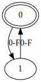
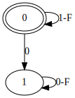
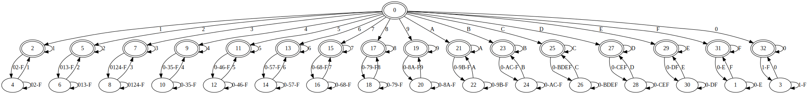

# bfa

Generating finite automata from restricted Brainfuck programs.

## Restricted how?

The main changes are:
- Fixed and finite tape length specified alongside the program (with wraparound).
- The `.` instruction now means "accept the input if the machine halts before the next successful read".
- The machine halts when:
  - Trying to read after consuming the entire input.
  - Moving beyond the end of the intructions (including while jumping from an unpaired loop instruction).
  - The machine enters an infinite loop without any read instructions.
- All cell and input values are limited to hexadecimal for simplicity.

## Examples
`bfa 2 "+[>.,,<]"` (accepts even-length inputs):\

`bfa 3 ">+[>.,[>]<<]"` (accepts inputs which don't contain `0`):\

`bfa 3 ".,>>+[.[,<<[->+>-<<]>[-<+>]>]+]"` (accepts inputs which start and end with the same character):\

